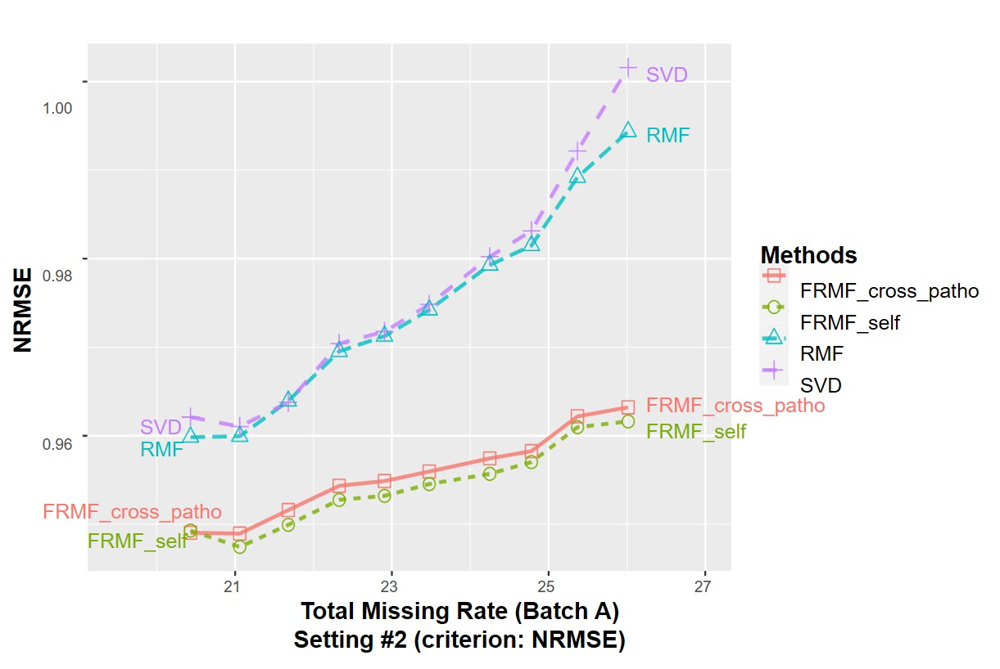
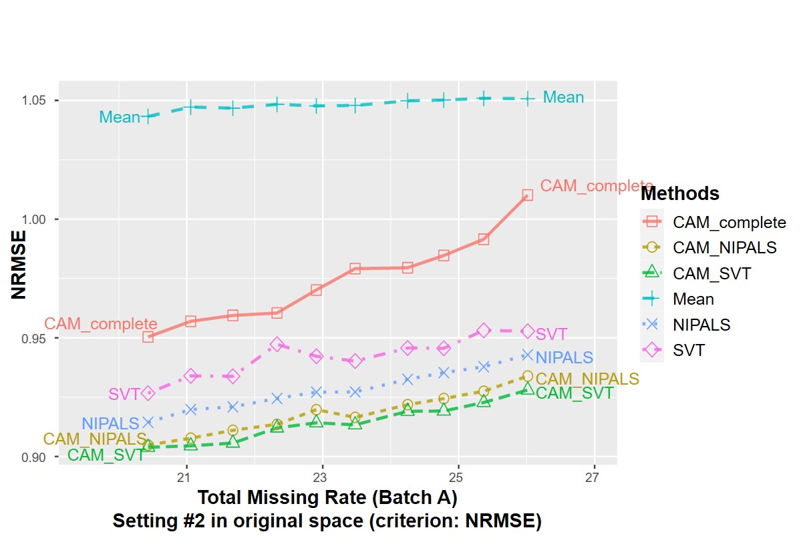

# ProImput
This is the repository of our article: Comparative assessment and outlook on methods for imputing proteomics data.

In our paper, We first report an assessment of eight representative methods collectively targeting three typical missing mechanisms. The selected methods are compared on both realistic simulation and real proteomics datasets, and the performance is evaluated using three quantitative measures. 

We then discuss a popular low-rank matrix factorization framework with similarity and/or biological regularization, which is extendable to integrating multi-omics data such as gene expressions or clinical variables. The preliminary results on proteomics data are provided together with an outlook into future development directions.

